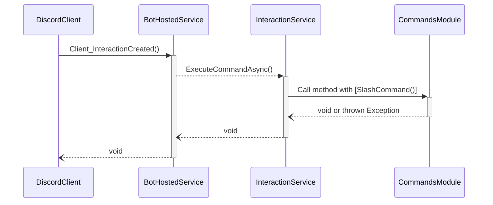
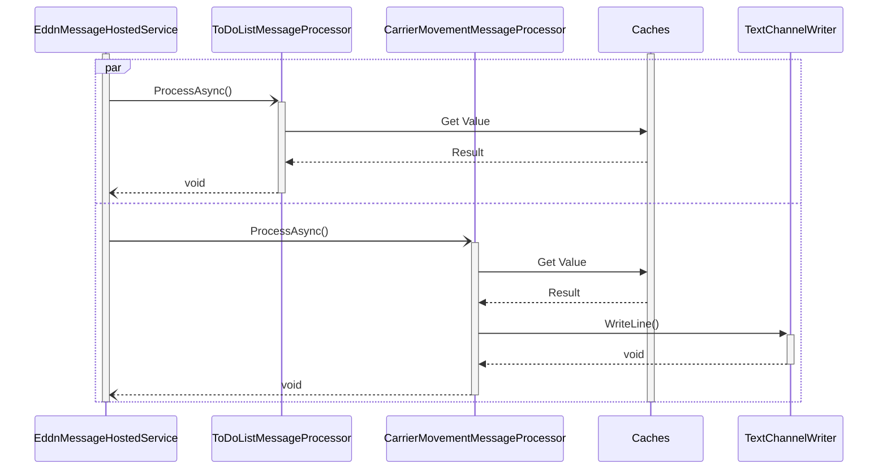

# Development

## Setup
This project is currently hosted in Azure. Run the [Deploy](../../../actions/workflows/deploy.yml) action to update the deployed version.

To setup locally:
1. Install [Docker Desktop](https://www.docker.com/products/docker-desktop/).
2. Create the database container:
    1. Download the SQL Server instance using `docker pull mcr.microsoft.com/mssql/server:2019-latest`
    2. Create and run a new SQL Server container using `docker run -e "ACCEPT_EULA=Y" -e "SA_PASSWORD=<password>" -e "MSSQL_PID=Express" -p 1433:1433 -d mcr.microsoft.com/mssql/server:2019-latest`, substituting `<password>` with a strong, unique password.
    3. Set the password for the new `OrderBot` login in `deploy/db.sql` login around line 7. 
    4. Run `deploy/db.sql` as sa, such as via [SQL Management Studio](https://learn.microsoft.com/en-us/sql/ssms/download-sql-server-management-studio-ssms?view=sql-server-ver16), to create the database.
    5. Run `deploy/tables.sql` as sa to create the table structure.
3. Create the application container:
    1. Download a base image for the application using `docker pull mcr.microsoft.com/dotnet/runtime:6.0`.
    2. Create a file called `.env` in `src/OrderBot`. Create four entries inside it:
        1. `ConnectionStrings__OrderBot`, containing the SQL server connection string.
        2. `Discord__ApiKey`, containing the Discord Bot's API key.
        3. `LogAnalytics__WorkspaceId`, containing an Azure LogAnalytics workspace ID.
        4. `LogAnalytics__WorkspaceKey`, containing an Azure LogAnalytics primary key.
4. Download, build and run the code.

## Writing Discord Commands

Overview:

Key points:
1. `CommandsModule` refers to a class that derives from `InteractionModuleBase<SocketInteractionContext>`. There are currently three:
    1. `AdminCommandsModule`, which handles administrative commands like audit and role management.
    2. `CarrierMovementCommandsModule`, which handles commands to ignore or track carrier movements. 
    3. `ToDoListCommandsModule`, which handlings viewing the To-Do list, supporting minor factions and adding goals. 
2. The `InteractionService` provided by Discord.Net provides a nice wrapper over manually parsing and handling commands.

`Client_InteractionCreated` in [BotHostedService](../../../tree/main/src/OrderBot/Discord/BotHostedService.cs) provides the following:
1. Creates a `IServiceScope` so scoped DI services can be returned and cleaned up.
2. Adds a logging scope with common details such as the user, guild and command details.
3. Acknowledges non-autocomplete requests using `DeferAsync`. This ensures long running commands do not time out withing three seconds. 
4. Logs a "Completed Successfully" message if the command does not throw any exceptions.
5. Shows an access denied-style error messages for unmet preconditions.
6. Responds to the user with the ephemeral contents of the `Message` property for thrown `DiscordUserInteractionExceptions`.
7. Logs details of other thrown exceptions.

Best practice for writing slash (application) commands:
1. Do not duplicate work in `BotHostedService.Client_InteractionCreated`. The general goal is to move as much work to there as possible. This standardizes behaviour and prevents code repetition.
2. Remember that the class housing the command handler is instantiated for each call.
3. Throw a `DiscordUserInteractionException` to represent a user-relevent and -solvable error, with the error message in the Message property. The error message can contain Discord markdown. 
4. Throw a different, appropriate exception for other errors.
5. Acknowledge success using an ephemeral message.
6. For success and error messages:
    1. Include `**Success**` or `**Error**` at the start to clearly indicate whether the command worked or did not, respectively.
    2. For errors, describe (1) why the error occured, (2) the resulting state and (3) how to fix or remedy.
7. Use `TransactionScope` around any database work, passing `TransactionScopeAsyncFlowOption.Enabled` to ensure it is async-friendly. Call `Complete()` as the last statement.
8. Audit any modifications using an `IAuditLogger`, ideally via a `TextChannelAuditLoggerFactory`.

## Message Processing
To provide data for the Discord bot, this system listens for [Elite Dangerous Data Network (EDDN)](https://eddn.edcd.io/) messages via the `EddnMessageHostedService`, which are handled by `EddnMessageMessageProcessor` subclasses. There are currently two: `TodoListMessageProcessor`, which captures system BGS data, and `CarrierMovementMessageProcessor`, which looks for carrier movements and notifies Discord guilds which have registered a carrier movement channel. These classes are instiated for each message.

This structure provides separation of responsibilities. Classes for each message processor are in separate namespaces to further emphasize this.

An overview:

Key points:
1. `EddnMessageHostedService` is started from Program.cs and runs for the liftetime of the container.
2. `Caches` includes various classes that inherit from `MessageProcessorCache`. Singleton objects instantiated from these cache classes minimize database access when processing and eliminating messages. 
    1. `TodoListMessageProcessor` uses `SupportedMinorFactionsCache` and `GoalStarSystemsCache`. 
    2. `CarrierMovementMessageProcessor` uses `StarSystemToDiscordGuildCache`, `IgnoredCarriersCache` and `CarrierMovementChannelCache`.
4. Technically, the `TextChannelWriter` is a `TextWriter` created via a `TextChannelWritterFactory`. This is used to write to carrier movement channel(s).
5. Database or ORM classes, such as `OrderbotDbContext` are omitted for clarity.

Regarding `Caches`, there is currently no cache invalidation mechanism but the cache durations are short: five minutes. An unfinished invalidation pattern is in `MessageProcessorCacheInvalidator`.

## References
1. Using Docker with .Net Core: https://docs.microsoft.com/en-us/aspnet/core/host-and-deploy/docker/visual-studio-tools-for-docker?view=aspnetcore-6.0
2. Github action to build SQL server database: https://github.com/ankane/setup-sqlserver
3. Discord.Net documentation: https://discordnet.dev/
4. Using Log Analytics with Container Instances: https://learn.microsoft.com/en-us/azure/container-instances/container-instances-log-analytics
5. CsvHelper quickstart: https://joshclose.github.io/CsvHelper/getting-started/
6. Avoid record types with Entity Framework: https://learn.microsoft.com/en-us/dotnet/csharp/language-reference/builtin-types/record
7. Mermaid Sequence diagrams: https://mermaid-js.github.io/mermaid/#/sequenceDiagram
