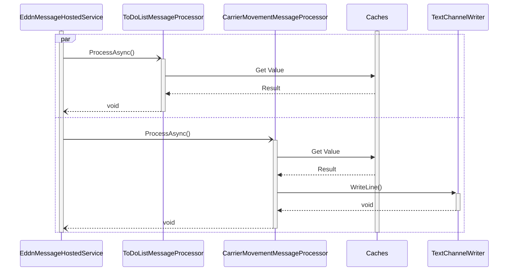

# Message Processing

## Overview

Key points:
1. `EddnMessageHostedService` is started from Program.cs and runs for the liftetime of the container
2. `Caches` includes various classes that inherit from `MessageProcessorCache`. These minimize database access when processing and eliminating messages.
3. Technically, the `TextChannelWriter` is a `TextWriter` created via a `TextChannelWritterFactory`. This is used to write to carrier movement channel(s).

### References
1. Mermaid Sequence diagrams: https://mermaid-js.github.io/mermaid/#/sequenceDiagram
